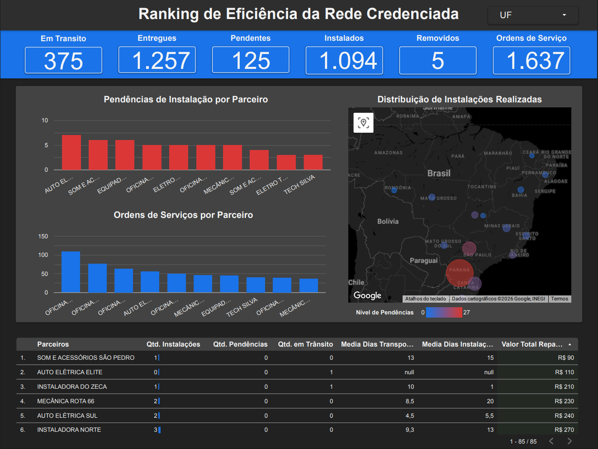

# Frota Rastreamento - Data Warehouse (ELT)




## 📌 Sobre o Projeto

Este projeto consiste na construção de um **Data Warehouse** completo para uma empresa de rastreamento veicular. O objetivo foi migrar o controle operacional, que antes era feito em planilhas dispersas, para uma arquitetura moderna em nuvem (**ELT**) integrada a um painel de Business Intelligence.

O sistema centraliza dados de **contratos de associados**, **logística de envio de rastreadores** e **gestão de parceiros instaladores**, permitindo análises de eficiência, faturamento e gargalos operacionais.

> **Nota:** Todos os dados sensíveis (CPF, Placas, E-mails, Telefones) presentes neste repositório são **fictícios**, gerados apenas para fins de estudo e demonstração.

---

## 🏗️ Arquitetura do Projeto

O projeto segue a **Arquitetura Medalhão** (Bronze, Silver, Gold) dentro do Google BigQuery:

| Camada | Descrição |
| :--- | :--- |
| **🥉 Bronze** | Ingestão dos arquivos CSV brutos (`associados`, `frota`, `instaladores`). Dados originais sem tratamento. |
| **🥈 Silver** | Limpeza, padronização e modelagem em **Star Schema** (Fatos e Dimensões). Criação de chaves substitutas (Hash) e tratamento de duplicidades. |
| **🥇 Gold** | Tabelas agregadas e prontas para consumo no Looker Studio (KPIs de Parceiros, Funil Logístico, Carteira). |

---

## 📊 Dashboard e Visualização de Dados

A camada Gold foi conectada ao **Google Looker Studio** para a criação de um dashboard executivo focado em tomada de decisão.

**Principais Visões:**
* **Ranking de Eficiência:** Análise de performance da rede credenciada (Instalados vs. Pendentes).
* **Mapa de Calor Geográfico:** Identificação visual de gargalos logísticos por estado (UF).
* **Funil Operacional:** Acompanhamento do ciclo de vida do rastreador (Envio > Entrega > Instalação).
* **Auditoria de Custos:** Controle de valores pagos por instalação e ticket médio por parceiro.

---

## 🛠️ Tecnologias e Técnicas Utilizadas

* **Google BigQuery:** Data Warehouse Serverless.
* **Looker Studio:** Ferramenta de visualização e storytelling de dados.
* **SQL (Dialeto BigQuery):**
    * **CTEs (Common Table Expressions):** Para modularizar a lógica e limpar o código.
    * **Window Functions (`QUALIFY ROW_NUMBER`):** Para deduplicação de registros e garantia de unicidade temporal.
    * **Funções de Hash (`MD5`):** Criação de chaves primárias e estrangeiras anonimizadas e robustas.
    * **Joins Complexos:** Cruzamento de fontes distintas (Contratos vs Logística) para gerar a visão 360º.
    * **Lógica Condicional (`CASE WHEN`, `COALESCE`):** Precificação dinâmica baseada no tipo de veículo e tratamento de nulos logísticos.

---

## 🗂️ Estrutura do Data Warehouse

### Camada Bronze (Raw Data)
* **`associados`:** Dados brutos dos clientes, contendo CPF, endereço e dados do contrato (Fonte: CRM/Vendas).
* **`base_frota`:** Log operacional contendo o envio dos rastreadores, placas e status de instalação (Fonte: Controle Logístico).
* **`instaladores`:** Lista bruta de parceiros credenciados, oficinas e tabelas de preços (Fonte: Gestão de Rede).

### Camada Silver (Star Schema)
* **`fct_instalacoes` (Tabela Fato):** Centraliza o ciclo de vida do rastreador (Contrato -> Envio -> Entrega -> Instalação). Contém métricas de tempo e valores financeiros.
* **`dim_associados`:** Dados cadastrais limpos e padronizados dos clientes.
* **`dim_veiculos`:** Detalhes técnicos da frota (Marca, Modelo, FIPE, Linha Pesada/Leve).
* **`dim_instaladores`:** Cadastro saneado de parceiros técnicos e regras de precificação por região.
* **`dim_dispositivos`:** Inventário único de rastreadores (IMEI).

### Camada Gold (Business Intelligence)
* **`agg_ranking_parceiros`:** Performance da rede credenciada (Quem instala mais? Quem tem gargalo? Qual o volume de repasse financeiro?).
* **`agg_status_operacao`:** Funil logístico detalhado por Estado (Quantidade em trânsito vs Estoque parado na oficina).
* **`agg_perfil_carteira`:** Visão comercial da base, segmentada por UF do cliente e Linha de Veículo (Soma do valor FIPE protegido).

---

## 📂 Estrutura do Repositório

```text
/frota-rastreamento
│
├── /dashboard                   # 📊 Visualização Final (Novo)
│   ├── dashboard_final.pdf      # Relatório completo em PDF
│   └── dashboard_final.png      # Imagem para preview
│
├── /data                        # Dados do Projeto (CSV)
│   ├── /1_bronze                # Arquivos originais (Ingestão)
│   │   ├── associados.csv
│   │   ├── base_frota.csv
│   │   └── instaladores.csv
│   │
│   ├── /2_silver                # Tabelas Fato e Dimensões exportadas
│   │   ├── fct_instalacoes.csv
│   │   ├── dim_associados.csv
│   │   └── ...
│   │
│   └── /3_gold                  # Tabelas Agregadas (KPIs finais)
│       ├── agg_ranking_parceiros.csv
│       ├── agg_status_operacao.csv
│       └── agg_perfil_carteira.csv
│
├── /sql                         # Scripts de Transformação (ELT) no BigQuery
│   ├── 1_silver_dimensoes.sql
│   ├── 2_silver_fatos.sql
│   └── 3_gold_agregacoes.sql
│
└── README.md                    # Documentação do projeto
